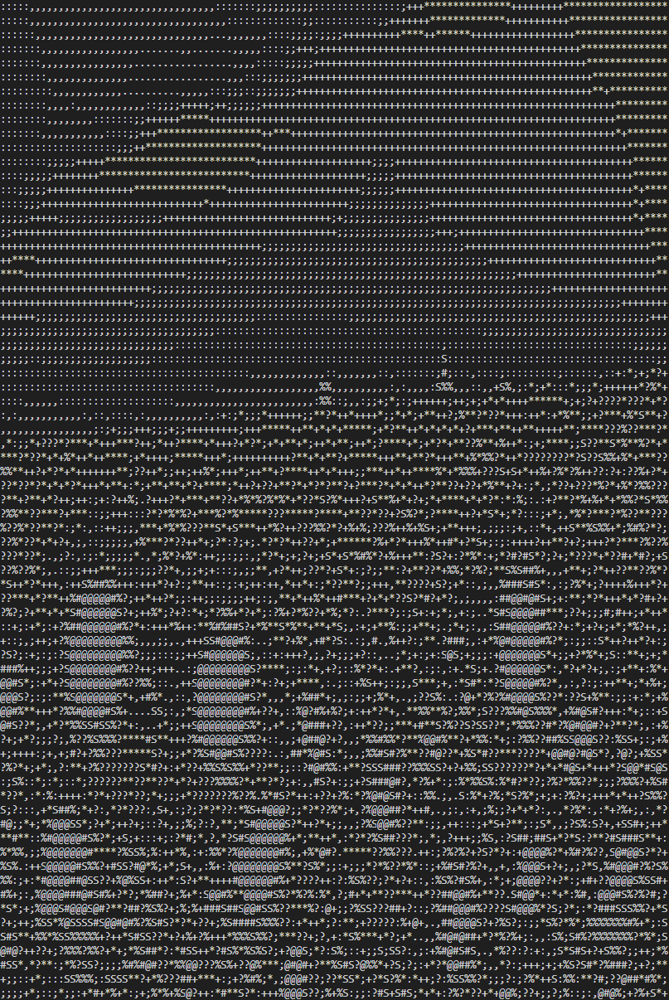
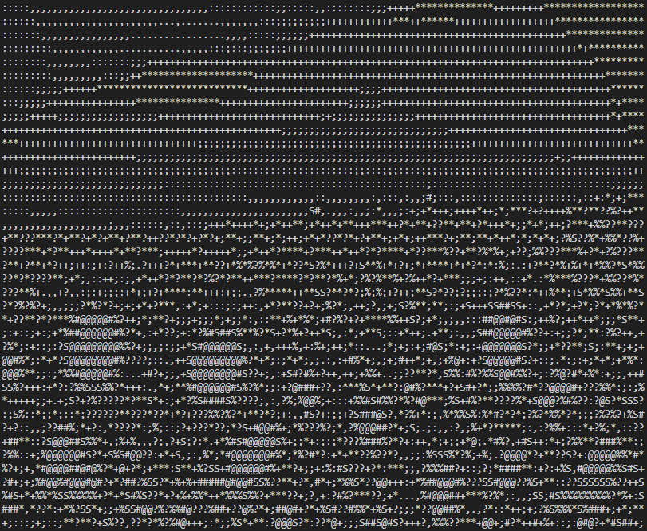
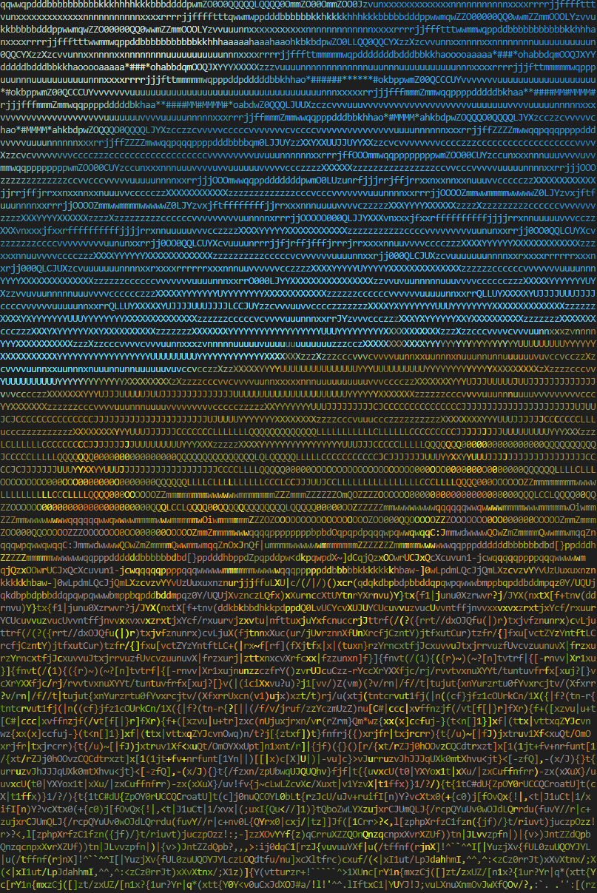
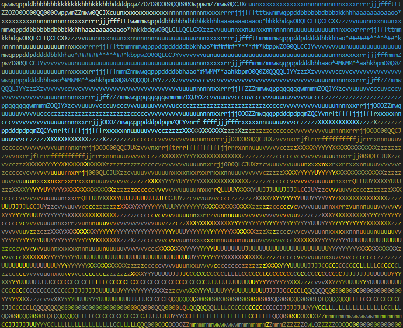

# Image in CLI

## Features

display image on shell !

Color (rgb pixel) / ASCII(gray-scale) mode

## Requirements

python 3.5 or later

terminal supporting ANSI escape code (for color mode)

dependency on opencv-python and numpy

## Usage

```markdown
showimg [-h] [-a] [-r] [-c] [-w [WIDTH]] [-s [STRING]] [-t] filename

Display image in terminal : Color or ASCII art

positional arguments:
  filename              path to image file

options:
  -h, --help            show this help message and exit
  -t, --terminal        print the current terminal column size and exit
  -a                    ascii mode: display image as ascii art (default: False)
  -r                    resize image - decrease height (default: False)
  -c                    advanced color mode: combine color and ascii mode (default: False)
  -w [WIDTH], --width [WIDTH]
                        width of the image in characters (default: terminal width * 0.8)
  -s [STRING], --string [STRING]
                        string to use for pixel representation in normal color mode (default: "██")
```

## Examples

**original image**


**color mode (default)**

```markdown
showimg image.png
```


**ascii mode**

```markdown
showimg image.png -a
```



**ascii mode - resized**

```markdown
showimg image.png -ar
```



**advanced color mode**

```markdown
showimg image.png -c
```



**advanced color mode - resized**

```markdown
showimg image.png -cr
```



## TODO

make setup script
